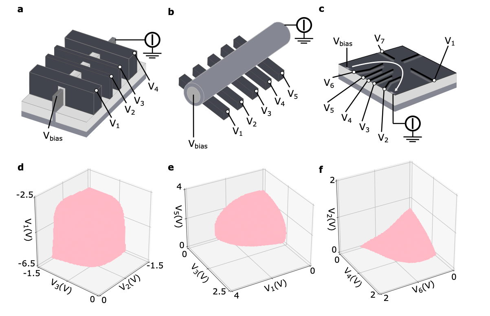

# Cross-architecture tuning solution using AI [[catsai](https://arxiv.org/abs/2107.12975)]



> Figure 1. Device schematics. Si FinFET (a), GeSi nanowire (b) and SiGe heterostructure (c) device architectures and their corresponding current pinch-off hypersurfaces for hole transport calculated using a Gaussian process model for one of the tuning algorithm runs (d, e, f). Three gates are plotted for illustrative purposes with the remaining gates on each device set to a constant value. The bias was kept constant throughout the experiment. CATSAI was given control over the gate electrodes V1 - V4, V1 - V5, and V1 - V7 on the FinFET, nanowire and heterostructure, respectively. ([arXiv:2107.12975](https://arxiv.org/abs/2107.12975) [cond-mat.mes-hall])

**NOTE: DUE TO MULTIPROCESSING PACKAGE THE CURRENT IMPLEMENTATION ONLY WORKS ON UNIX/LINUX OPERATING SYSTEMS [TO RUN ON WINDOWS FOLLOW THIS GUIDE](Resources/Running_on_windows.md)**

The quantum devices used to implement spin qubits in semiconductors can be challenging to tune and characterise. Often the best approaches to tuning such devices is manual tuning or a simple heuristic algorithm which is not flexible across devices. This repository contains the statistical tuning approach detailed in [Cross-architecture Tuning of Silicon and SiGe-based Quantum Devices Using Machine Learning, arXiv:2107.12975 [cond-mat.mes-hall]](https://arxiv.org/abs/2107.12975). See [here](https://www.nature.com/articles/s41467-020-17835-9) for the approach by [Moon et al.](https://www.nature.com/articles/s41467-020-17835-9) This approach is promising as it make few assumptions about the device being tuned and hence can be applied to many systems without alteration. `catsai` shows this by being demonstrated across three different device architectures. **For instructions on how to run a simple fake environment to see how the algorithm works see [this README.md](Playground/README.md)**

## Dependencies
The required packages required to run the algorithm are:
```
scikit-image
scipy
numpy
matplotlib
GPy
mkl
pyDOE
```
# Using the algorithm
Using the algorithm varies depending on what measurement software you use in your lab or what you want to achieve. Specifically if your lab utilises pygor then you should call a different function to initiate the tuning. If you are unable to access a lab then you can still create a virtual environment to test the algorithm in using the Playground module. Below is documentation detailing how to run the algorithm for each of these situations.
## Without pygor
To use the algorithm without pygor you must create the following:
- jump
- measure
- check
- config_file

Below is an **EXAMPLE** of how jump, check, and measure **COULD** be defined for a 5 gate device with 2 investigation (in this case plunger) gates.

<ins>jump:</ins>
Jump should be a function that takes an array of values and sets them to the device. It should also accept a flag that details whether the investigation gates (typically plunger gates) should be used. 
```python
def jump(params,inv=False):
  if inv:
    labels = ["dac4","dac6"] #plunger gates
  else:
    labels = ["dac3","dac4","dac5","dac6","dac7"] #all gates
    
  assert len(params) == len(labels) #params needs to be the same length as labels
  for i in range(len(params)):
    set_value_to_dac(labels[i],params[i]) #function that takes dac key and value and sets dac to that value
  return params
```
<ins>measure:</ins>
measure should be a function that returns the measured current on the device.
```python
def measure():
  current = get_value_from_daq() #receive a single current measurement from the daq
  return current
```
<ins>check:</ins>
check should be a function that returns the state of all relevant dac channels.
```python
def check(inv=True):
  if inv:
    labels = ["dac4","dac6"] #plunger gates
  else:
    labels = ["dac3","dac4","dac5","dac6","dac7"] #all gates
  dac_state = [None]*len(labels)
  for i in range(len(labels)):
    dac_state[i] = get_current_dac_state(labels[i]) #function that takes dac key and returns state that channel is in
  return dac_state
```
<ins>config_file:</ins>
config_file should be a string that specifies the file path of a .json file containing a json object that specifies the desired settings the user wants to use for tuning. An example string would be "config.json". For information on what the config file should contain see the json config section.

### How to run
To run tuning without pygor once the above has been defined call the following:
```python
from catsai.tune import tune_from_file
tune_from_file(jump,measure,check,config_file)
```
## With pygor
To use the algorithm without pygor you must create the following:

<ins>config_file:</ins>
config_file should be a string that specifies the file path of a .json file containing a json object that specifies the desired settings the user wants to use for tuning. An example string would be "config.json". For information on what the config file should contain see the json config section. Additional fields are required to specify pygor location and setup.
### How to run
To run tuning with pygor once the above has been defined call the following:
```python
from catsai.tune import tune_with_pygor_from_file
tune_with_pygor_from_file(config_file)
```
## With playground (environment)
To use the algorithm using the playground you must create the following:

<ins>config_file:</ins>
config_file should be a string that specifies the file path of a .json file containing a json object that specifies the desired settings the user wants to use for tuning. An example string would be "config.json". 

The config you must supply the field "playground" then in this field you must specify the basic shapes you want to build your environment out of. Provided is a [demo config file](mock_device_demo_config.json) and a [README](Playground/README.md) detailing how it works and what a typical run looks like.

### How to run
To run tuning with pygor once the above has been defined call the following:
```python
from catsai.tune import tune_with_playground
tune_with_playground(config_file)
```
